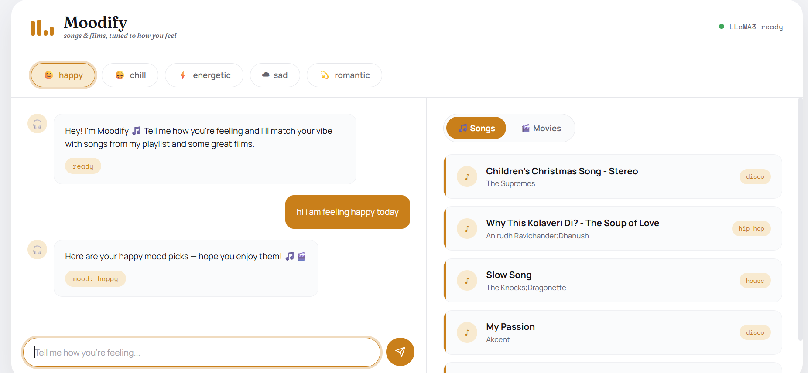
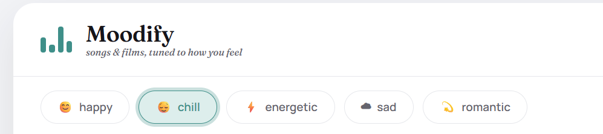
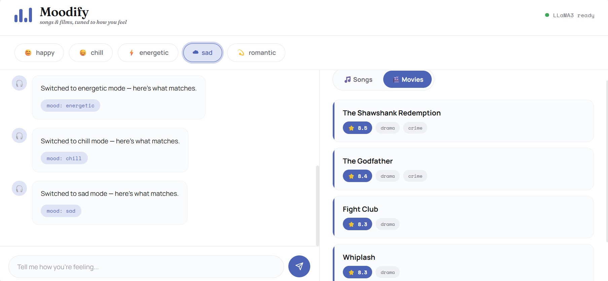

# 🎵 Moodify
### *songs & films, tuned to how you feel*

[](https://python.org)
[](https://flask.palletsprojects.com)
[](https://scikit-learn.org)
[](https://ollama.com)
[](LICENSE)

Moodify is a full-stack AI-powered mood-based recommender that suggests **movies and songs** based on how you're feeling. Type how you feel in natural language — LLaMA3 detects your mood and the ML engine returns personalised picks.

---

## ✨ Features

- 🤖 **Conversational mood detection** — type anything like *"I'm feeling low today"* and LLaMA3 extracts your mood automatically
- 🎵 **Song recommendations** — cosine similarity on Kaggle Spotify audio features (valence, energy, danceability, tempo)
- 🎬 **Movie recommendations** — genre matching + vote-based filtering using TMDB API
- 🎛️ **Mood buttons** — quick-select happy, chill, energetic, sad, romantic
- 📑 **Songs / Movies tabs** — clean split view for results
- 🟢 **LLaMA3 status indicator** — live readiness check on page load

---

## 📸 Screenshots

### Chat interface — mood detection in action


### Mood button selection


### Movies tab — sad mood


---

## 🛠️ Tech Stack

| Layer | Technology |
|-------|-----------|
| Backend | Python, Flask |
| ML | scikit-learn (cosine similarity, MinMaxScaler) |
| LLM | LLaMA3 via Ollama (local) |
| Songs Data | Kaggle — Spotify Tracks Dataset (114k tracks, filtered to English) |
| Movies Data | TMDB 5000 Movies Dataset + TMDB API for posters |
| Frontend | HTML, CSS, Vanilla JavaScript |

---

## 🧠 How It Works

```
User types message
        ↓
LLaMA3 extracts mood (happy / sad / energetic / chill / romantic)
        ↓
        ├── Song Recommender → cosine similarity on audio features
        │        ↓ top 5 matching tracks
        │
        └── Movie Recommender → genre match + vote filter + TMDB API posters
                 ↓ top 5 matching films
        ↓
LLaMA3 generates a warm personalised intro
        ↓
Results displayed in chat + Songs/Movies panel
```

### Song Recommendation Logic
The Kaggle Spotify Tracks Dataset (114,000 tracks) was preprocessed in a Jupyter notebook to extract only English language songs. The filtering pipeline used:
- **Genre whitelist** — kept only western/English genres (pop, rock, hip-hop, jazz etc.)
- **ASCII character check** — removed tracks with non-ASCII characters in title or artist name
- **langdetect library** — language detection on track names to confirm English
- Final filtered dataset: ~9,200 English tracks saved as `tracks_english.csv`

Each song has Spotify audio features — `valence` (happiness), `energy`, `danceability`, and `tempo`. A mood profile is defined as a vector of these values (e.g. happy = high valence, high energy). MinMaxScaler normalises all values to 0–1, then cosine similarity finds the closest matching songs.

### Movie Recommendation Logic
Movies are matched by genre (e.g. energetic → Action, Thriller, Adventure) using the TMDB 5000 dataset, filtered by `vote_average ≥ 7.0` and `vote_count ≥ 500` to ensure quality. Movie posters are fetched live from the TMDB API.

---

## 🚀 Getting Started

### Prerequisites
- Python 3.10+
- [Ollama](https://ollama.com) installed with LLaMA3 pulled

```bash
ollama pull llama3
ollama serve
```

### Installation

```bash
# Clone the repo
git clone https://github.com/Soumya-205/Moodify.git
cd Moodify

# Create virtual environment
python -m venv venv
venv\Scripts\activate      # Windows
# source venv/bin/activate  # Mac/Linux

# Install dependencies
pip install -r requirements.txt
```

### Dataset Setup

Download these datasets from Kaggle and place them in the `data/` folder:

- [TMDB 5000 Movies](https://www.kaggle.com/datasets/tmdb/tmdb-movie-metadata) → `data/tmdb_5000_movies.csv`
- [Spotify Tracks Dataset](https://www.kaggle.com/datasets/maharshipandya/-spotify-tracks-dataset) → run `notebooks/explore.ipynb` to generate `data/tracks_english.csv`

### Environment Variables

Create a `.env` file in the root folder:

```
TMDB_API_KEY=your_tmdb_api_key_here
```

Get a free TMDB API key at [themoviedb.org](https://www.themoviedb.org/settings/api).

### Run the App

```bash
# Make sure Ollama is running first
ollama serve

# Then start Flask
python app.py
```

Open `http://127.0.0.1:5000` in your browser.

---

## 📁 Project Structure

```
Moodify/
├── data/                    # Datasets (not tracked by git)
│   ├── tmdb_5000_movies.csv
│   └── tracks_english.csv
├── notebooks/
│   └── explore.ipynb        # ML exploration and English filtering pipeline
├── static/
│   ├── style.css
│   └── script.js
├── templates/
│   └── index.html
├── screenshots/             # App screenshots
├── app.py                   # Flask backend
├── recommender.py           # ML logic + LLaMA3 integration
├── requirements.txt
├── .env                     # API keys (not tracked)
└── README.md
```

---

## 🔌 API Endpoints

| Method | Endpoint | Description |
|--------|----------|-------------|
| `POST` | `/chat` | Conversational mood → recommendations via LLaMA3 |
| `POST` | `/recommend` | Direct mood → recommendations (no LLM) |
| `GET` | `/moods` | List valid moods |
| `GET` | `/health` | Server health check |

### Example `/chat` request

```json
POST /chat
{
  "message": "I'm feeling a bit low today"
}
```

```json
Response:
{
  "reply": "Here are some picks to match your mood...",
  "mood": "sad",
  "songs": [...],
  "movies": [...]
}
```

---

## 📦 Requirements

```
flask
flask-cors
pandas
scikit-learn
requests
python-dotenv
langdetect
```

Install all with:
```bash
pip install -r requirements.txt
```

---

## 🗺️ Roadmap

- [x] Song recommender with cosine similarity
- [x] English language filtering pipeline (genre + ASCII + langdetect)
- [x] Movie recommender with genre + vote filter
- [x] TMDB API integration for movie posters
- [x] LLaMA3 mood detection via Ollama
- [x] Conversational chat interface
- [x] Songs / Movies tab view
- [ ] Spotify preview links for songs
- [ ] Cloud deployment

---

## 👩‍💻 Author

**Soumya Shradha** — BTech CSE (Data Science), Manipal University Jaipur

[](https://github.com/Soumya-205)
[](https://www.linkedin.com/in/soumya-shradha-164443327)
[](https://www.kaggle.com/soumyashradha)

---

## 📄 License

This project is licensed under the MIT License.
